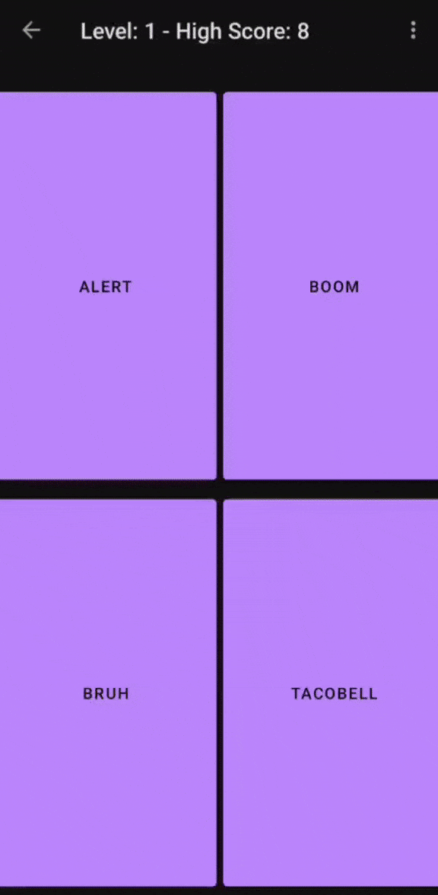

# Remember Game

Android remembering game written in kotlin

# Description

This is a simple remembering game written in kotlin programming language. The game shows a player buttons to press and the player has to press those buttons in the same order. Also the game has sounds.

# Installing

You can download the app and play the game by yourself. Releases page of this repository has the latest version of the game's apk.

# Building

I used gradle as the build system. You can use android studio to build and deploy app by yourself.
